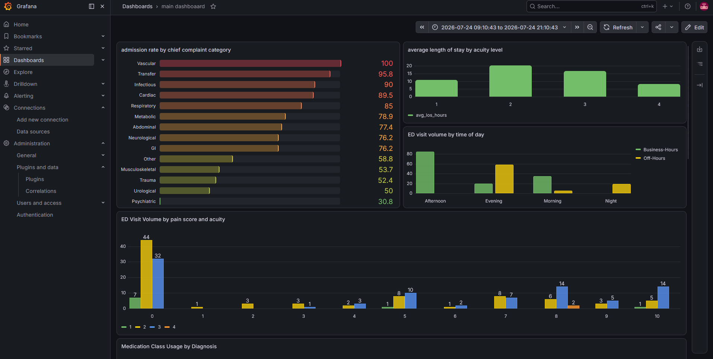
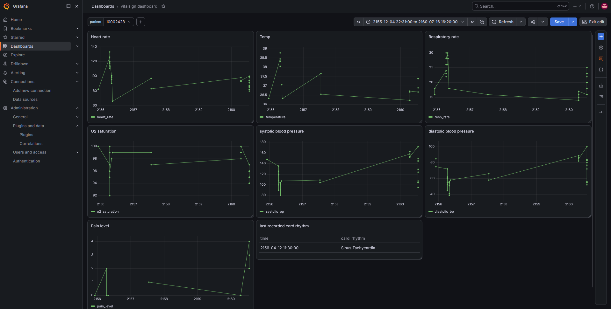
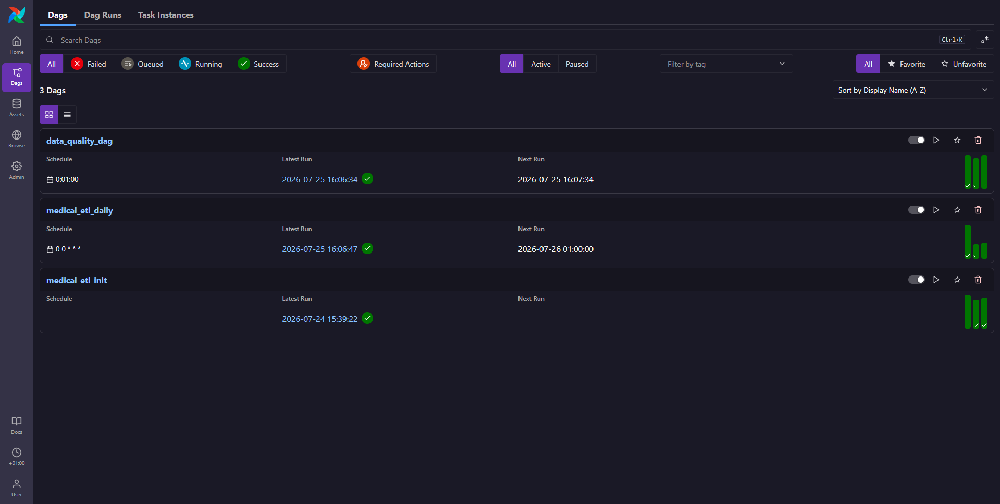

# 🏥 Medical Data Quality Pipeline

A production-grade ELT pipeline for medical datasets — built on the tools that 57,000+ companies actually run in production: Python, Apache Airflow, dbt, PostgreSQL, Docker, Pandas, Pandera, and Grafana.

---

## 🚀 Overview

This project demonstrates a modular, production-ready ELT pipeline designed to handle messy medical data and make it analysis-ready for analytics or machine learning workflows.

The stack is built entirely on tools that dominate real job postings and company infrastructure in 2026 — no niche frameworks, no early-stage bets. Every tool here is battle-tested, widely documented, and actively hiring for.

**Data source:** [MIMIC-IV-ED Demo](https://physionet.org/content/mimic-iv-ed/2.2/) — a publicly available emergency department dataset from PhysioNet.

---

## 📊 Dashboards

### Main Analytics Dashboard


### Patient Vitalsign Monitoring


### Airflow DAGs


---

## 🧱 The Stack — Why Each Tool

| Tool | Role | Why It's Here |
|------|------|---------------|
| **Python 3.12** | Core language | In 78%+ of all DE job postings |
| **Apache Airflow 3** | Orchestration | 8,375+ companies, OpenAI runs 7,000 pipelines on it |
| **dbt Core** | Transformation | 57,000+ companies, the SQL transformation standard |
| **PostgreSQL** | Source + target DB | Most widely used open-source relational DB |
| **Pandas 3.x** | In-memory processing | 77% adoption among data engineers |
| **Pandera** | DataFrame validation | Production-ready schema testing for Pandas/Polars |
| **Docker + Compose** | Containerization | 59% of professional developers, fully reproducible |
| **Grafana** | Observability | Industry standard monitoring and visualization |
| **pytest** | Testing | Standard Python testing framework |

---

## ⚙️ Features

- **Extract** — Pull raw medical data from PostgreSQL and MSSQL via custom DB abstraction layer
- **Load (raw)** — Land raw records into a PostgreSQL raw schema with transaction safety and NULL handling
- **Transform (dbt)** — Clean, normalize, and apply business rules using version-controlled SQL dbt models
- **Validate** — Pandera schema checks on all DataFrames; 166 dbt tests on all models after transformation
- **Orchestrate** — 3 Apache Airflow DAGs with scheduling, retries, and dependency management
- **Monitor** — Grafana dashboards for patient vitalsign tracking, admission analytics, and medication patterns
- **Log** — Structured multi-level logging (info / warning / error / critical) to tiered log files
- **Containerized** — Full stack runs with a single `docker-compose up` command

---

## 🏗️ Project Structure

```
medical_data_quality_pipeline/
│
├── pyproject.toml              # Project metadata and dependencies
├── docker-compose.yml          # Full stack: pipeline + Airflow + PostgreSQL + Grafana
├── .env.input                  # Template for environment config
├── pytest.ini
├── README.md
│
├── requirements/
│   ├── base.txt                # Core dependencies
│   ├── dev.txt                 # Development + testing dependencies
│   └── prod.txt                # Production dependencies
│
├── data/
│   ├── input/                  # Raw MIMIC-IV-ED source files
│   └── output/                 # Processed and validated output datasets
│
├── dbt/                        # dbt project
│   ├── models/
│   │   ├── staging/            # Raw → typed, renamed, light cleaning (6 models)
│   │   └── marts/              # Star schema (7 dims + 5 facts + 1 bridge)
│   ├── macros/                 # Reusable Jinja SQL macros
│   │   ├── pain_filter.sql     # Clinical pain score classification
│   │   ├── fahr_to_celsius.sql # Temperature unit conversion
│   │   ├── extract_race.sql
│   │   └── extract_country.sql
│   ├── tests/                  # Custom singular dbt tests
│   └── seeds/                  # Static reference data (discharge status codes)
│
├── dags/                       # Airflow DAG definitions
│   ├── medical_etl_dag.py      # Full ELT pipeline (manual trigger)
│   └── data_quality_dag.py     # Standalone quality checks (scheduled)
│
├── src/
│   ├── main.py                 # Manual pipeline entry point
│   ├── config/                 # Environment and logging configuration
│   ├── db_connection/          # DB abstraction layer (PostgreSQL + MSSQL)
│   │   └── connectors/         # Driver-specific implementations
│   ├── extract/                # Mart data extraction to DataFrames
│   ├── load/                   # CSV → raw schema loader
│   ├── quality/                # Validation (raw + mart layers + Pandera schemas)
│   └── utils/                  # Shared helpers (SQL sanitization, metrics)
│
├── tests/                      # pytest unit + integration tests
├── docs/                       # Project documentation
├── monitoring/                 # Grafana dashboard JSON
└── notebooks/                  # Exploratory analysis and ML proof-of-concept
```

---

## 🔧 Skills Demonstrated

### Applied from prior experience
- **Python 3.12** — OOP, abstract base classes, type hints, modular packaging
- **SQL & PostgreSQL** — Window functions, CTEs, schema design, DDL
- **Pandas 3.x** — Data cleaning, datetime normalization, memory-efficient reads

### Learned to build this project
- **dbt Core** — Staging/marts model design, YAML schema tests, Jinja macros, lineage docs
- **Apache Airflow 3** — DAG authoring, PythonOperator, BashOperator, scheduling, retries
- **Pandera** — Per-table DataFrame schemas, medical-domain range checks, custom validators
- **Docker & Compose** — Multi-service stack, volumes, networking
- **pytest** — Fixtures, mocking DB connections, Pandera schema tests
- **Grafana** — Dashboard building, time-series panels, variable filters, Sankey charts
- **Logging** — Structured tiered logging for production observability
- **Medical domain** — MIMIC-IV-ED schema, clinical data ranges, data dictionary authoring

---

## 🚀 Getting Started

### Option 1 — Docker (recommended, runs everything)

```bash
# clone and configure
git clone https://github.com/rayenbenyoussef/Medical_data_quality_pipeline
cd Medical_data_quality_pipeline
copy .env.input .env   # Windows
# cp .env.input .env   # Linux/Mac
# fill in your credentials in .env

# start the full stack
docker-compose up --build
```

| Service | URL |
|---------|-----|
| Airflow UI | http://localhost:8080 |
| Grafana | http://localhost:3000 |

### Option 2 — Local setup

See the full installation guide: [docs/deployment.md](docs/deployment.md)

---

## 🗄️ Database Schema

### Mart Layer — Star Schema

**Dimensions:**
- `dim_patients` — patient demographics (gender, race, region)
- `dim_date` — calendar date dimension with season/weekday
- `dim_hour` — time-of-day dimension at minute granularity (1,440 rows)
- `dim_medications` — medication reference (name, GSN, NDC, ETC classification)
- `dim_icd_classification` — ICD-9/10 diagnosis codes
- `dim_etc_classification` — therapeutic drug classification codes
- `dim_chiefcomplaint` — chief complaint categories (14 clinical categories)

**Facts:**
- `fct_ed_visits` — one row per ED visit, includes merged triage assessment
- `fct_vitalsigns` — repeated vital sign measurements per visit
- `fct_diagnosis` — diagnoses per visit with primary/secondary flag
- `fct_medrecon` — pre-visit medications reported by patient
- `fct_pyxis` — medications dispensed during visit by automated machine

**Bridge:**
- `bridge_triage_complaints` — visit ↔ chief complaint (many-to-many)

---

## 📈 Analyses

Built in `notebooks/main.ipynb`:

- Admission rate by chief complaint category
- Average length of stay by acuity level
- ED visit volume by time of day and shift type
- Vital sign comparison: admitted vs non-admitted patients
- Top 10 primary diagnoses by frequency
- Medication class usage by diagnosis (drug class → diagnosis mapping)
- Seasonal medication dispensing patterns
- ML proof-of-concept: logistic regression for admission prediction

---

## 📋 Data Quality

- **166 dbt tests** — not_null, unique, accepted_values, relationships, expression_is_true
- **Pandera schemas** — typed validation on all 5 mart DataFrames
- **Raw validation** — row count, column count, and null checks after every CSV load
- **Custom clinical tests** — cross-table plausibility checks (e.g. acuity=1 with pain=0 flagged as suspicious)

---

## 🗂️ Airflow DAGs

| DAG | Schedule | Purpose |
|-----|----------|---------|
| `medical_etl_init` | Manual | Full pipeline: load raw → dbt staging → dbt marts |
| `medical_etl_daily` | Daily (midnight) | Refresh mart layer from updated staging |
| `data_quality_dag` | Every minute | Run dbt tests + Pandera mart validation |

---

## Author

Rayen Ben Youssef
GitHub: https://github.com/rayenbenyoussef